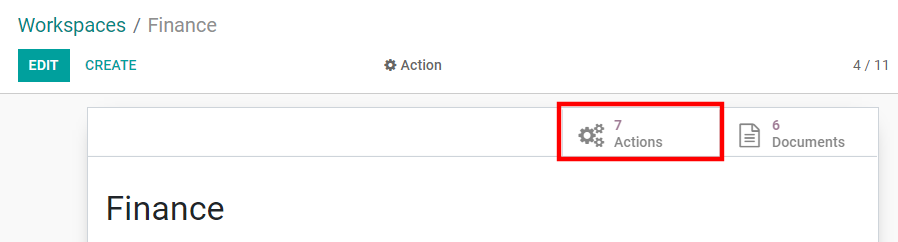
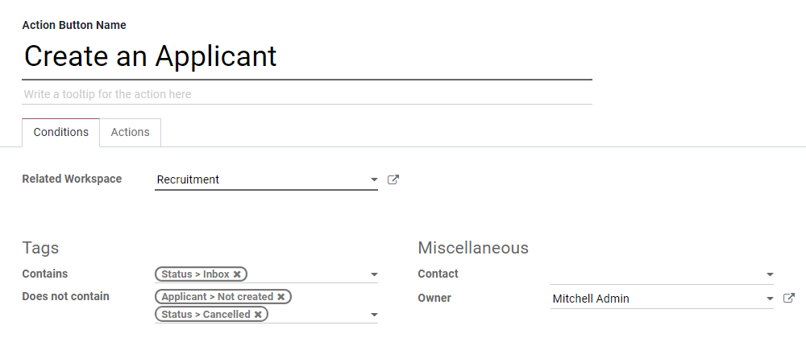
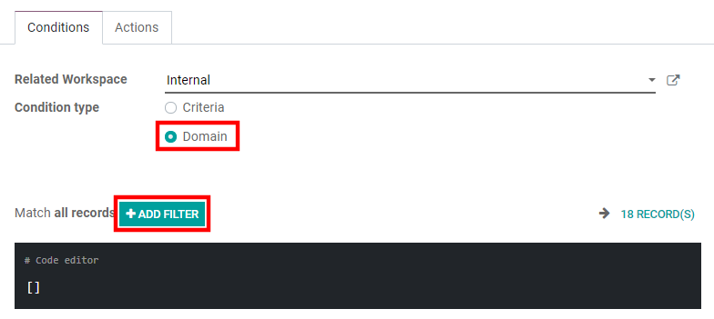
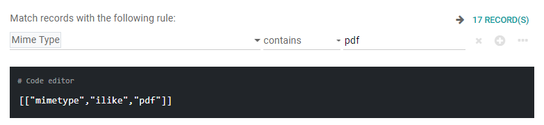
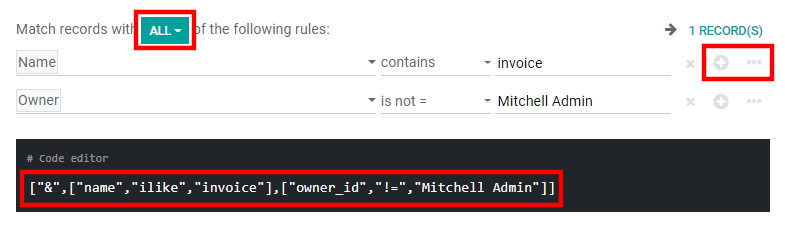
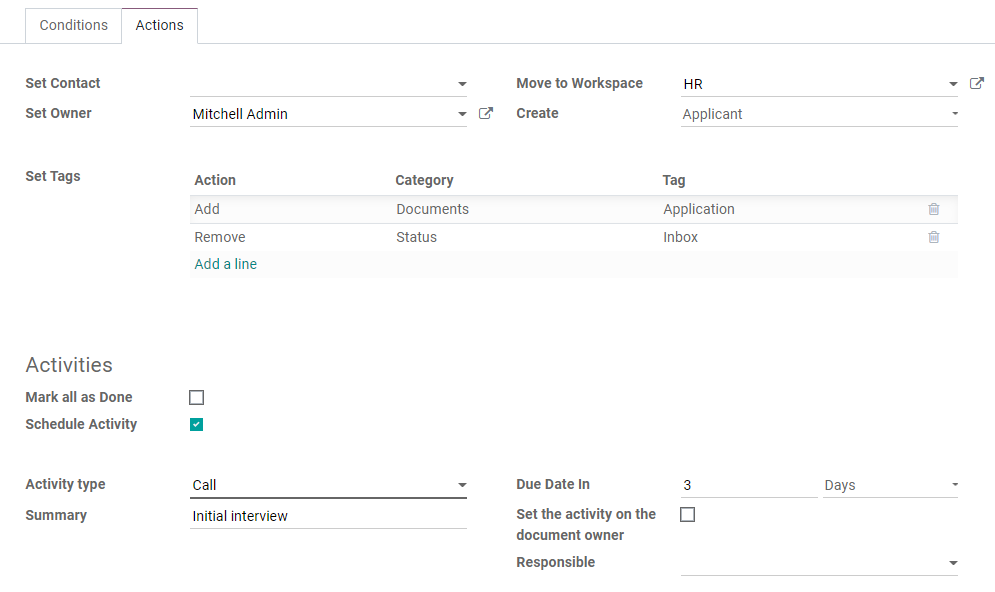

================
Workflow actions
================

Workflow actions are automated actions you can create and customize at the level of each
workspace. They appear next to a file whenever it meets the criteria you set. That way you can,
for example, add tags to a file or move it to another workspace with a single click. Workflow
actions help you streamline the management of your documents and your overall business operations.

Create workflow actions
=======================

To create workflow actions, go to :menuselection:`Configuration --> Workspaces` and select the
workspace where the action should apply. Click on the *Actions* smart button, and then on *Create*.

.. note::
   An action applies to all *Child Workspaces* under the *Parent Workspace* you selected (i.e. to
   all sub-folders under the selected folder).

.. tip::
   If you use the :doc:`developer mode <../../general/developer_mode/activate>`, you can access
   directly all your actions by going to :menuselection:`Configuration --> Actions`.

Set the conditions
------------------

After naming your workflow action, you can set the conditions that trigger the appearance of the
action button on the right-side panel when selecting a file.

There are three basic types of conditions you can set:

#. **Tags**: you can both use the *Contains* and *Does not contain* conditions, meaning the files
   *must have* or *mustn't have* the tags set here.

#. **Contact**: the files must be associated with the contact set here.

#. **Owner**: the files must be associated with the owner set here.

.. tip::
   If you don't set any condition, the action button appears for all files located inside the
   workspace you selected.

Advanced condition type: domain
~~~~~~~~~~~~~~~~~~~~~~~~~~~~~~~

.. important:: It is recommended to have some knowledge of Odoo development to properly configure
   *Domain* filters.

To access the *Domain* condition, the :doc:`developer mode <../../general/developer_mode/activate>`
needs to be activated. Once that's done, select the *Domain* condition type, and click on *Add
Filter*.

To create a rule, you typically select a field, an operator, and a value. For example, if you want
to add a workflow action to all the PDF files inside a workspace, set the field to: *Mime Type*, the
operator to *contains*, and the value to *pdf*.

Click on *Add node* (plus circle icon) and *Add branch* (ellipsis icon) to add conditions and
sub-conditions. You can then specify if your rule should match *ALL* or *ANY* conditions. You can
also edit the rule directly using the *Code editor*.

Configure the actions
---------------------

Select the *Actions* tab to set up your action. You can simultaneously:

#. **Set Contact**: add a contact to the file, or replace an existing contact with a new one.

#. **Set Owner**: add an owner to the file, or replace an existing owner with a new one.

#. **Move to Workspace**: move the file to any workspace.

#. **Create**: create one of the following items attached to the file in your database:

   1. **Product template** (create a product you can edit directly)
   2. **Task** (create a Project task you can edit directly)
   3. **Signature request** (create a new Sign template to send out)
   4. **Sign directly** (create a Sign template to sign directly)
   5. **Vendor bill** (create a vendor bill using OCR and AI to scrape information from the file
      content)
   6. **Customer invoice** (create a customer invoice using OCR and AI to scrape information from
      the file)
   7. **Vendor credit note** (create a vendor credit note using OCR and AI to scrape information
      from the file)
   8. **Credit note** (create a customer credit note using OCR and AI to scrape information from the
      file)
   9. **Applicant** (create a new HR application you can edit directly)

#. **Set Tags**: add, remove, and replace any number of tags.

#. **Activities - Mark all as Done**: mark all activities linked to the file as done.

#. **Activities - Schedule Activity**: create a new activity linked to the file as configured in the
   action. You can choose to set the activity on the document owner.

