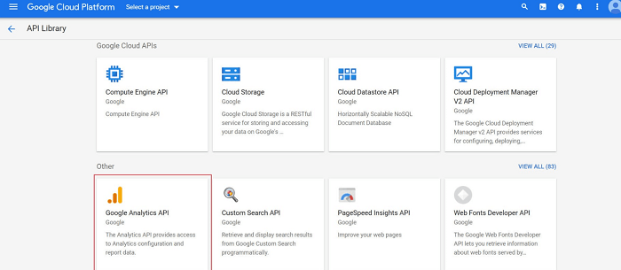

=============
Track traffic
=============

Now that you've created a beautiful website with incredible content, it's time to see how well it
is performing with your audience. That's why it's important to track your website's traffic. With
Odoo, users are able to track this vital information in a number of different ways.

Track traffic in Google Analytics
=================================

To follow your website's traffic with Google Analytics:

- `Create a Google Analytics account <https://www.google.com/analytics/>`__ if 
  you don't have one.

- Go through the creation form and accept the conditions to get the tracking ID.  

    .. image:: tracking_analytics/google_analytics_account.png
       :align: center
       :alt: google analytics account

- Copy the tracking ID to insert it in Odoo.

    .. image:: tracking_analytics/google_analytics_tracking_id.png
       :align: center
       :alt: google analytics tracking id

- Go to the *Configuration* menu of your Odoo's Website app.
  In the settings, turn on Google Analytics and paste the tracking ID.
  Then, save the page.

      .. image:: tracking_analytics/google-analytics-setting.png
         :align: center
         :alt: google analytics setting

To make your first steps in Google Analytics, refer to `Google Documentation
<https://support.google.com/analytics/answer/1008015?hl=en/>`_.

Track traffic from Odoo Dashboard
=================================

You can follow your traffic statistics straight from your Odoo Website 
Dashboard, thanks to Google Analytics.

- A preliminary step is creating a Google Analytics account, and entering the
  tracking ID in your Website's settings.

- Go to `Google APIs platform library <https://console.cloud.google.com/apis/library?supportedpurview=project>`__
  to generate Analytics API credentials. Log in with your Google account.

- Create a new project and give it a name (e.g. Odoo).
  This project is needed to store your API credentials.

.. image:: tracking_analytics/google_analytics_create_project.png
   :align: center
   :alt: google analytics create project

- Select Google Analytics API from the library.

- Enable the API.

.. image:: tracking_analytics/google_analytics_enable.png
   :align: center
   :alt: google analytics enable api

- Create credentials to use in Odoo.

.. image:: tracking_analytics/google_analytics_create_credentials.png
   :align: center
   :alt: google analytics create credentials

- Select *Web browser (Javascript)* 
  as calling source and *User data* as kind of data.

.. image:: tracking_analytics/google_analytics_get_credentials.png
   :align: center
   :alt: google analytics api get credentials

- Then, you can create a Client ID.
  Enter the name of the application (e.g. Odoo) and the allowed pages on 
  which you will be redirected. The *Authorized JavaScript origin* is your 
  Odoo's database URL. The *Authorized redirect URI* is your Odoo's database
  URL followed by '/google_account/authentication'.

.. image:: tracking_analytics/google_analytics_authorization.png
   :align: center
   :alt: google analytics authorization

- Go through the Consent Screen step by entering a product name 
  (e.g. Google Analytics in Odoo). Feel free to check the customizations options,
  but this is not mandatory. The Consent Screen will only show up when you enter 
  the Client ID in Odoo for the first time.

- Finally, you are provided with your Client ID. Copy and paste it in Odoo.

.. image:: tracking_analytics/google_analytics_client_id.png
   :align: center
   :alt: google analytics client id

- Open your Website Dashboard in Odoo, and link your Analytics account to
  your Client ID.

.. image:: tracking_analytics/google_analytics_start.png
   :align: center
   :alt: google analytics start

- As a last step, authorize Odoo to access Google API.

.. image:: tracking_analytics/google_analytics_login.png
   :align: center
   :alt: google analytics login

Link Trackers
=============

Link Trackers allow you to track your marketing campaigns (emails, banner ads, blog posts, social
media posts, affiliate links, etc.). This way, you are able to identify your best traffic sources
and make informed decisions about the distribution of your marketing budget.

Go to :menuselection:`Website --> Go to Website --> Promote --> Link Tracker`. Here, you are able
to get a specific tracked URL based on the campaign, medium, and source being used.

.. image:: tracking_analytics/link_tracker_fields.png
   :align: center
   :alt: View of the link tracker fields for Odoo Website

- **URL**: URL of the page you want to track (e.g. the home page or a product page).
- **Campaign**: context of your link (e.g. a special promotion).
- **Medium**: channel used to share (deliver) your link (e.g. an email or a Facebook ad).
- **Source**: platform where the traffic originates (e.g. Google or Twitter).

Now, click on *Get tracked link* to generate a URL that you can post (or send) by the source you
have decided on.

Follow-up on tracked links
==========================

To look at statistics of your links, go to :menuselection:`Website --> Go to website --> Promote
--> Link Tracker`. Besides being able to see the *Most Clicked* and *Recently Used* links, you
can also see complete statistics by clicking on *Stats*, including the number of clicks, and the
country of origin for those clicks.

.. image:: tracking_analytics/links_statistics.png
   :align: center
   :alt: View of the tracked list emphasizing the statistics buttons in Odoo Website

.. tip::

   #. You can also access the link tracker on *odoo.com/r* via your browser.
   #. Activate the developer mode (:menuselection:`Settings --> Activate the developer mode`) and
      get access to the *Link Tracker* module and its back-end functionalities.
   #. Integrated with Google Analytics, those trackers allow you to see
      the number of clicks and visitors to keep you on top of your marketing campaigns.
